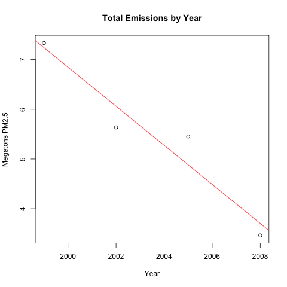
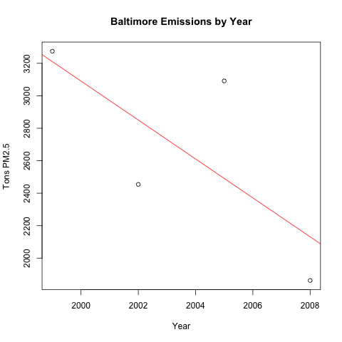
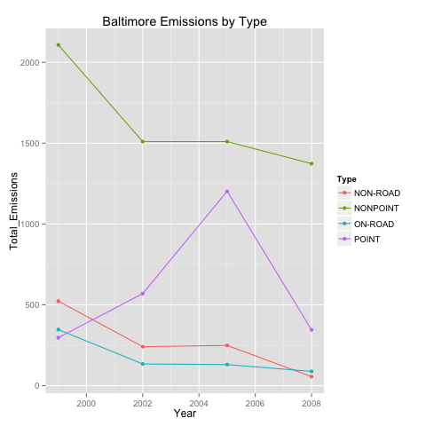
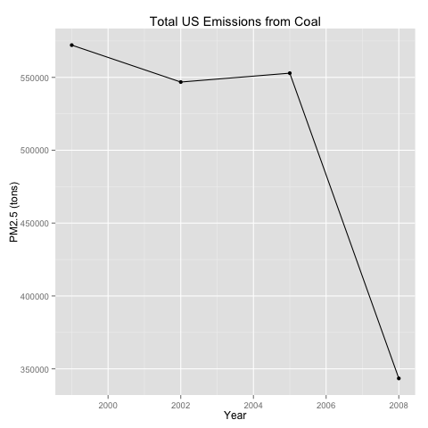
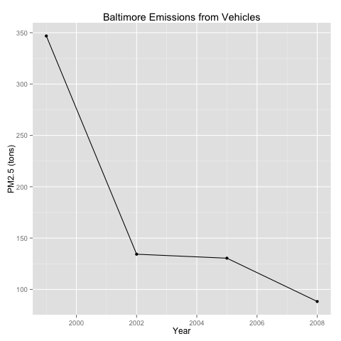
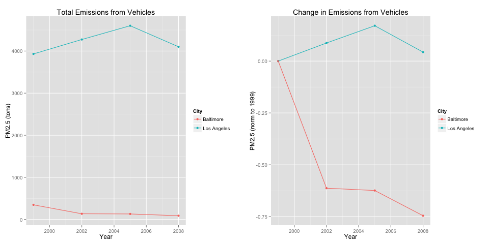

===
title: "Readme.MD for JH 'Exploratory Data Analysis Project 2'"
author: "Matthew Pemble"
output: html_document
===

# Readme.MD
============
## Course
This is the Readme file for the second course project
for the Johns Hopkins "Exploratory Data Analysis"
Coursera course.

Author: Matthew Pemble
Github: github.com/mwapemble
Course: exdata-033, 5 Oct 15

## Data

###<b>Description</b>: 

### Plot 1
This script 
<ol>
<li>initialises the single variable,</li>
<li>downloads the data if this is required</li>
<li>sets the display to the required PNG format</li>
<li></li></ol>

### Plot 2
This script 
<ol>
<li>initialises the single variable,</li>
<li>downloads the data if this is required</li>
<li>sets the display to the required PNG format</li>
<li></li></ol>

### Plot 3
This script 
<ol>
<li>initialises the single variable,</li>
<li>downloads the data if this is required</li>
<li>sets the display to the required PNG format</li>
<li></li>
</ol>

### Plot 4
This script:
<ol>
<li>initialises the single variable,</li>
<li>downloads the data if this is required</li>
<li>sets the display to the required PNG format</li>
<li></li></ol>

### Plot 5
This script:
<ol>
<li>initialises the single variable,</li>
<li>downloads the data if this is required</li>
<li>sets the display to the required PNG format</li>
<li></li></ol>

### Plot 6
This script:
<ol>
<li>initialises the single variable,</li>
<li>downloads the data if this is required</li>
<li>sets the display to the required PNG format</li>
<li></li></ol>

## Results

### Plot 1
 

### Plot 2
 

### Plot 3
 

### Plot 4

### Plot 5

### Plot 6

## Acknowledgements
As well as the lectures and swirl tutorial, guidance on the use of specific functions was gained from:
<ul>
<li>"R in Action", 2nd Ed, R Kabacoff</li>
<li>"Cookbook for R", online version, W Chang</li>
<li>RStudio.com, especially the "R Markdown Cheat Sheet"</li>
<li>and syntax examples from various stackoverflow.com threads (via the mechanism of Google).</li></ul>

